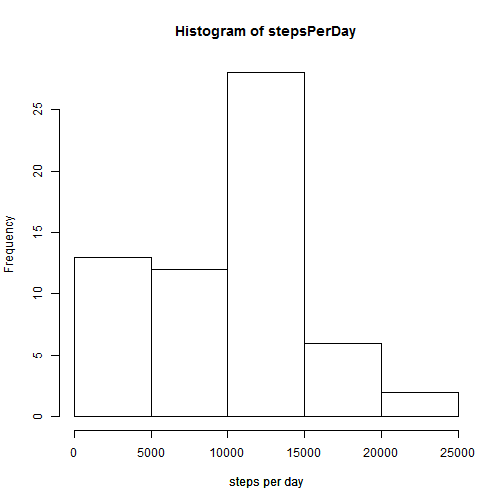
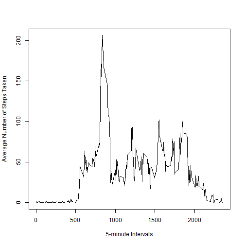
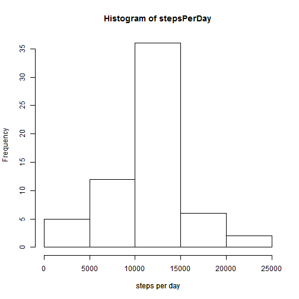
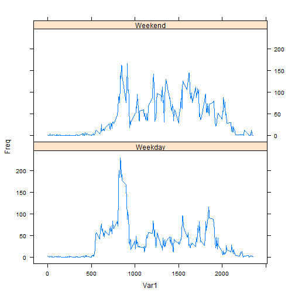

# Reproducible Research: Peer Assessment 1


## Loading and preprocessing the data


```r
data <- read.csv("activity/activity.csv")
```

## Histogram of the total number of steps taken each day

```r
stepsPerDay =  tapply(data$steps, data$date, sum, na.rm = TRUE)
hist(stepsPerDay, xlab="steps per day")
title(xlab="steps per day")
```

 
## Mean total number of steps taken per day 

```r
mean(stepsPerDay)
```

```
## [1] 9354
```

## Median total number of steps taken per day

```r
median(stepsPerDay)
```

```
## [1] 10395
```


## Time series plot of the 5-minute interval and the average number of steps taken, averaged across all days

```r
avgNumStepsPerInterval <- tapply(data$steps, data$interval, mean, na.rm = TRUE)
plot(names(avgNumStepsPerInterval), avgNumStepsPerInterval, type="l", xlab="5-minute Intervals", ylab="Average Number of Steps Taken")
```

 

## 5-minute interval, on average across all the days in the dataset, containing the maximum number of steps

```r
names(avgNumStepsPerInterval)[which.max(avgNumStepsPerInterval)[[1]]]
```

```
## [1] "835"
```


## Imputing missing values

##  total number of missing values in the dataset

```r
sum(is.na(data$steps))
```

```
## [1] 2304
```

## strategy for filling in all of the missing values in the dataset
### missing values in steps column are filled up with mean number of steps of corresponding 5-minute intervals.

##  new dataset that is equal to the original dataset but with the missing data filled in.

```r
nas <- which(is.na(data$steps))
avgNumStepsPerIntervalFrame <- as.data.frame(as.table(avgNumStepsPerInterval))
avgNumStepsPerIntervalFrame[,1] = as.numeric(as.character(avgNumStepsPerIntervalFrame[,1]))
data$steps[nas] = sapply(nas, function(x) 
                    avgNumStepsPerIntervalFrame[,2][avgNumStepsPerIntervalFrame[,1]==data$interval[x]])

head(data)
```

```
##     steps       date interval
## 1 1.71698 2012-10-01        0
## 2 0.33962 2012-10-01        5
## 3 0.13208 2012-10-01       10
## 4 0.15094 2012-10-01       15
## 5 0.07547 2012-10-01       20
## 6 2.09434 2012-10-01       25
```

## Histogram of the total number of steps taken each day with NA's filled in 

```r
stepsPerDay =  tapply(data$steps, data$date, sum, na.rm = TRUE)
hist(stepsPerDay, xlab="steps per day")
title(xlab="steps per day")
```

 
## Mean total number of steps taken per day with NA's filled in

```r
mean(stepsPerDay)
```

```
## [1] 10766
```

## Median total number of steps taken per day with NA's filled in

```r
median(stepsPerDay)
```

```
## [1] 10766
```

## Impact of imputing missing data on the estimates of the total daily number of steps?
### imputing missing data increase the average total daily number of steps as expected

## Are there differences in activity patterns between weekdays and weekends?

## Creating a new factor variable in the dataset with two levels - "weekday" and "weekend" indicating whether a given date is a weekday or weekend day.


```r
bool <- (weekdays(as.Date(data$date))=="Sunday") | ((weekdays(as.Date(data$date))=="Saturday"))
data$day = "Weekday"
data$day[which(bool)] = "Weekend"
head(data)
```

```
##     steps       date interval     day
## 1 1.71698 2012-10-01        0 Weekday
## 2 0.33962 2012-10-01        5 Weekday
## 3 0.13208 2012-10-01       10 Weekday
## 4 0.15094 2012-10-01       15 Weekday
## 5 0.07547 2012-10-01       20 Weekday
## 6 2.09434 2012-10-01       25 Weekday
```

## Making a panel plot containing a time series plot of the 5-minute interval (x-axis) and the average number of steps taken, averaged across all weekday days or weekend days (y-axis).


```r
avg1 <- tapply(data$steps[which(data$day=="Weekday")], data$interval[which(data$day=="Weekday")], mean)
avg2 <- tapply(data$steps[which(data$day=="Weekend")], data$interval[which(data$day=="Weekend")], mean)
avg1 <- as.data.frame(as.table(avg1))
avg2 <- as.data.frame(as.table(avg2))
avg1$day="Weekday"
avg2$day="Weekend"
avg <- rbind(avg1, avg2)
head(avg)
```

```
##   Var1    Freq     day
## 1    0 2.25115 Weekday
## 2    5 0.44528 Weekday
## 3   10 0.17317 Weekday
## 4   15 0.19790 Weekday
## 5   20 0.09895 Weekday
## 6   25 1.59036 Weekday
```

```r
avg$Var1 <- as.numeric(as.character(avg$Var1))
library(lattice)
```

```
## Warning: package 'lattice' was built under R version 3.0.3
```

```r
xyplot(Freq ~ Var1 | day, data=avg, layout=c(1,2), type='l')
```

 


